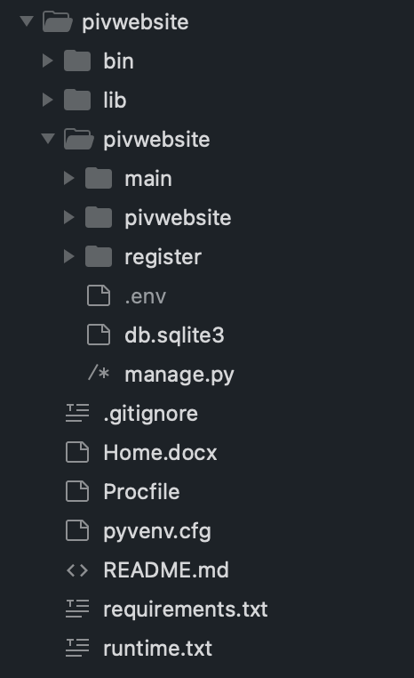

# Learnpiv.org Documentation
#### By: Kevin Roberts
#### Last modified: October/2022
NOTE: This documentation is written as if heroku is the hosting service for Learnpiv.org.

## Introduction and Purpose

This documentation file was created to describe the code written for Learnpiv.org. Learnpiv.org is a Django-based website; 
a high-level Python web framework. The purpose of Learnpiv.org is to educate novice PIV (Particle Image Velocimetry) learners
as well as advanced PIV educators. Our driving goal is to create a user-friendly, cost-efficient environment where students, 
teachers, and all other learners can study PIV with ease. 

## Structure and Outside Sources

(structure)
The overall structure of learnpiv is shown below and is very much based off a Django Framework:

(include environment variables)
(include Github)
(include AWS)
(include Mailjet)
(include Gmail)
(include Heroku)

## Code Additions, Navigation and Testing

(include database access through both admin and heroku terminal)
(include migrations)

(how to add/test code)
For the developer, if a change in the code is to be made, one must first have the learnpiv project cloned from the github 
repository and put somewhere on their computer. Testing to see if the website will run on their device is vital before making 
and changes. The developer must first open up a terminal and navigate to the where the learnpiv project is cloned: 

The developer must then activate the virtual environment with the following command ``source bin/activate``, and ``cd`` 
into the pivwebsite folder: 

Finally, to run the site locally, the user must execute the command: ``python manage.py runserver``, copy the given link,
and paste it into a browser: 

After pasting the link into a browser, you should see the following: 

This is a "testing version" of the website. The developer is free to create users, run experiments, and test anything in
the website. If the developer does create any users or experiments or anything that will modify the database, then the said 
data will be saved in a local database file, namely: ``db.sqlite3``. This database file is saved and pushed to github as 
we don't include it in our ``.gitignore`` file. Modifications made to ``db.sqlite3`` WILL NOT be uploaded to the database 
in heroku. Heroku uses a separate Postgres Database. Thus, when pulling from the github repository, ``dpsqlite`` may be 
edited, however the developer should not pay mind to it's edits as it's treated as a "testing database".

(heroku rollback)
(push heroku)
(how to test in local environment)

## Code Descriptions

(say that you'll go through each folder and file)

### bin/

### lib/

### pivwebsite/

### pivwebsite/main/

### pivwebsite/pivwebsite/

### pivwebsite/register/

### pivwebsite/.env

### pivwebsite/db.sqlite3

### pivwebsite/manage.py

### .gitignore

### Home.docx

### pyvenv.cfg

### Procfile

### requirements.txt 

### runtime.txt 