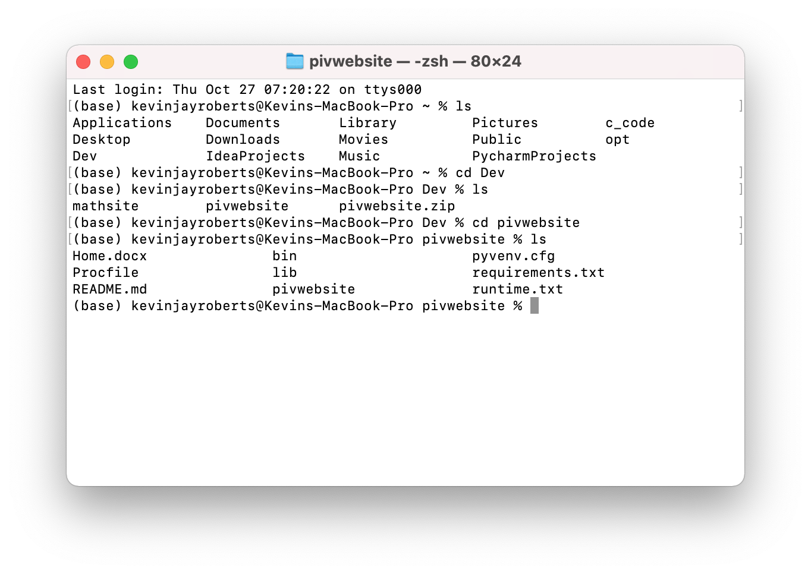
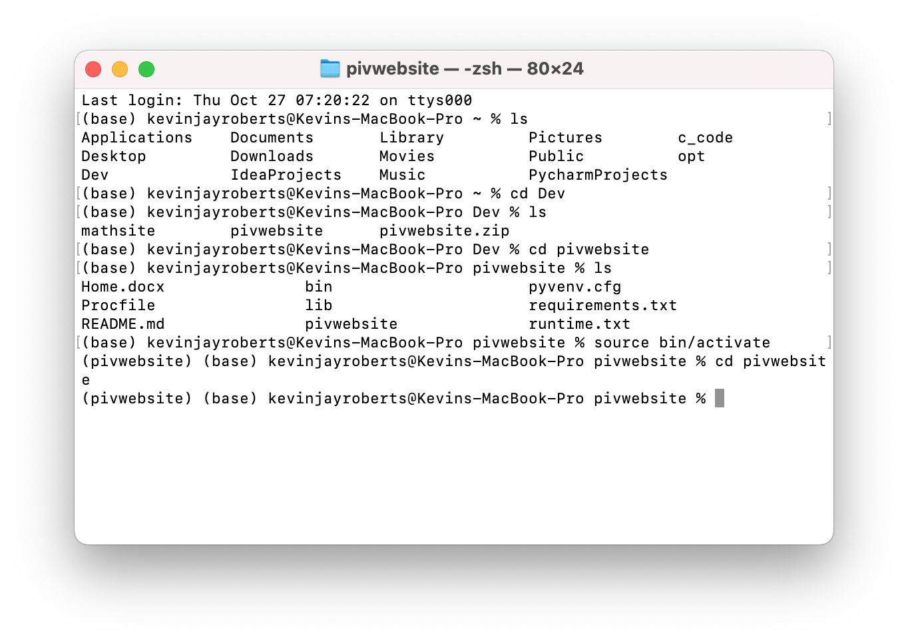
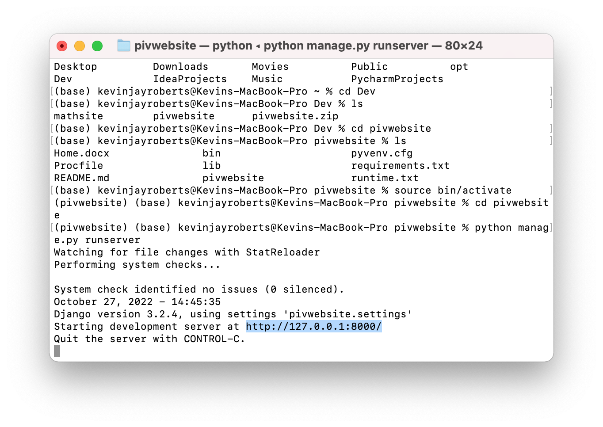

# Learnpiv.org Documentation
#### By: Kevin Roberts
#### Last modified: January/2023

## Introduction and Purpose

This documentation file was created to describe the code written for Learnpiv.org. Learnpiv.org is a Django-based website; 
a high-level Python web framework. The purpose of Learnpiv.org is to educate novice PIV (Particle Image Velocimetry) learners
as well as advanced PIV educators. Our driving goal is to create a user-friendly, cost-efficient environment where students, 
teachers, and all other learners can study PIV with ease. 

## Structure and Outside Sources

### Structure
The overall structure of learnpiv is shown below and is very much based off a Django Framework:

### Github
We use a Github repository to store all our code updates and progress. This repository is currently private, but can be accessed by 
the permission of the repository holder Kevin Roberts (kevinjrob9@gmail.com). As heroku is the host of the website, it requires
access to the information from the Github account. If one is to edit the website, one must first make changes and push them
to the github account, then afterwards push the github code to heroku. This will be shown more in depth in the following
Code Additions, Navigation and Testing section.

### AWS
AWS or Amazon Web Services, is where we keep all of our static images, videos, css, and javascript code. All of this information 
is kept in a s3 bucket called learnpiv-images. This bucket includes a static folder which holds all static and new information
that can be uploaded into the website. Additionally, the experiment images that a user creates and saves are also stored 
in this bucket. It may seem odd that the bucket holds static and non-static information, but that is just the format
of the bucket for now.

Another important note, please observe the following structure of the website, similar to what was shown above, only the 
main/ folder is expanded: 

Notice how css/ and js/ are folders that are included in the code that's pushed to the github repository. These folders are
included solely to make testing javascripts functions and css styles easier. If anything in these folders is changed and
pushed to the github repository and then pushed to heroku, then the live site WILL NOT include these changes because heroku
is grabbing information from the AWS s3 bucket, and not from the folders that have been pushed. To be consistent in making 
changes to the css styles and javascript functions, it must be tested locally first (again, how to test will be shown below),
and then the developer must include these changes additionally to the s3 bucket. This must be done to make changes to the
website that are shown publicly and not just locally. In the settings.py file of the project, in the AWS information section, 
it is shown that the STATICFILES_STORAGE is connected to the AWS s3 bucket. This variable ensures that the static files 
are taken from the s3 bucket and not from the static/ folder in the project when the project is in production. To make the
website use the static information from the bucket, one must navigate into the project, activate it, and run ``python manage.py collectstatic``.
This process is shown in the figure below: 

### Mailjet
Mailjet is the mailing service we chose to send emails to our users. The only types of emails that we currently send to users
include email for resetting account password, and emails to notify a user for when they've submitted a content suggestion, 
and finally an email if their suggestion was accepted or declined. Our Mailjet information can be found in the email section 
of the setting.py file, and it's usage can be found in the register/views.py file as well as the main/views.py file in the
project.

### Gmail
Coordinating with mailjet, we have created a learnpiv gmail account: learnpiv@gmail.com. This gmail account is the account that will send all
the mail to the users of the learnpiv.com website. Mailjet uses this email to send mail. As of now this is the only use for the gmail account.

### Heroku
Heroku is the host of the entire django app project. Heroku is a cloud platform as a service (Paas) that allows us to update, 
monitor, and scale the learnpiv.com application. There are a few important aspects of Heroku that we are using which I'll 
list below and explain:

#### General Information

Upon logging into the heroku account, you should see something like the following which is a list of applications. In our
case, we only have the learnpiv app: 

To navigate into all the learnpiv app general information, click on the app and you will be brought to the following page: 

Before November 28th, 2022, Heroku allowed us to freely host the learnpiv app. More specifically, we did not have to pay 
for Dynos or for the Postgres database. Now they are charging all apps on these aspects and that's what's being explained
in the red box in the figure above. Below the red box, one can see that we are using Heroku's Postgres database to store 
all of our data, as well as an eco dyno plan, and I'll explain further what dynos actually are a little later.

To the right of the Add-ons in the figure above are the latest deploys. This is one of the nicer features of Heroku. Here 
you can see if your builds have succeeded, when you last deployed, and differences in deployment. Additionally, you can 
click on View build log to observe errors in the build. This is a great way to debug if the application has failed to build. 
These builds are initiated whenever environment variables are changed, Add-ons are added, and when pushing code from the
github repository. The command ``git push heroku main`` is the command to push code from the repository to heroku, and I 
go over how this is done more specifically in the Code Additions, Navigvation, and Testing section. 

It's important to always keep the code and files in heroku the exact same as the code and files in the github repository.
One may ask, "Why should I have to worry about this if heroku is always just using the code that's pushed from the github
repository?" The reason one should worry is, because we have written code that writes code to certain files in heroku after 
a user interacts with the website and not in the github repository. This was an earlier development issue, which has been 
resolved in such a way that only YOU, the developer, can make the changes. It's just important to understand that there 
can be differences in the code in heroku and the code in the github repository. Making sure the code is consistent in both
is good practice and can easily be done by pushing code from the repository to heroku.

Observe the following tabs in the figure above on the heroku website. The second tab in Resources where one can find more
information about the add-ons that are being used (for learnpiv, we only use Dynos and Postgres). The next tab, Deploy, 
includes more information about the connection Heroku has with the github repository. In this section you can also allow 
manual deploys and set up different code connections. We are not currently using any of these additional features. The final 
tab to keep in mind is of course the Settings tab. The information in this tab includes environment variables, domain names, 
and a convenient Maintenance Mode option, which is nice to use when there are bugs in the website. It shuts down the site
so that nobody can access it while the developer can fix any bugs. In the next few paragraphs I'll go over Dynos, Slugs, 
environment variables, and more information on the database, all of which are heavy aspects of heroku.

#### Dynos

In the Heroku documentation, it is said that Dynos are simply lightweight Linux containers dedicated to running the application
processes. For now, the learnpiv application is using the Eco plan for Dynos, meaning we get 1000 dyno hours shared across
all our Eco dynos. A heroku dyno is essentially an instance of a server that contains all the learnpiv application's code, 
dependencies (like matplotlib, Pillow, BeautifulSoup, etc), and environment variables pre-loaded into it. A heroku dyno can
also run any process that comprises the learnpiv app. To learn more on scaling dynos, heorku provides wonderful documentation
[here](https://devcenter.heroku.com/articles/dyno-types#:~:text=From%20the%20Heroku%20Dashboard&text=Click%20the%20app%20you%20want,Professional%20(Standard%2FPerformance).).
To ensure that the scaling of dynos is working, be sure to be in the pivwebsite folder that contains manage.py. For me it's 
Users/kevinjayroberts/Dev/pivwebsite/pivwebsite

#### Slugs

From the heroku documentation, Slugs are said to be "compressed and pre-packaged copies of your application optimized for 
distribution to the dyno manager". When code from the github repository is pushed to heroku, it is recieved by the slug 
compiler. This compiler transforms the information into a slug. Scaling an application (scaling dynos as described above) 
downloads and expands the slug into a dyno for execution. As of January 2023, the learnpiv application is using 316.1 MiB 
of 500 MiB available slug size. There are times when pushing code up to heroku in the terminal, one may get a message
saying that "your slug size is too large". A most common cause of this is because there is too much data being pushed to 
heroku that the slugs can't handle. We ran into this issue many times after pushing code to heroku that included images.
This also may happen if the packages being loaded are too large. It's always good practice to make sure that all the packages 
in the requirements.txt folder are necessary to the project. If there are packages that aren't being used in the website, 
then they should not be included in the requirements.txt because it'll just take up more slugs that don't need to be used.

#### Postgres database

The Postgres database is a managed SQL database service that is provided by heroku. We are using this database to store
all the users' information in the website except for their generated images (which are being stored in the AWS s3 bucket).
There are a variety of ways that you can view the information stored in the Postgres database. The most general way is through
the Heroku account. In the home page of application (see image above), to view more database information, click on the 
purple Heroku Postgres link. This page gives general information on Connections, Rows, Data Size, and Tables. Connections 
describe how many users are logged in and viewing the content. Note that this is only for when users are logged in and not 
just viewing the content on the website. Rows are defined as single groups of related data within a table. Data Size is, 
well, how much data we are using. We are allowed 1 GB with the current plan we are paying for. We don't have to worry about 
this increasing too rapidly because what really increases the database size is users' saved images, which we are storing 
in AWS. The only data that will be added to the website (that will not be handled by the developer) will be when a new user 
creates an account. Tables are referring to essentially how many models the website has. Models will be explained further 
down in the documentation, but here I'll show you a few ways how to access the database Tables through the website itself 
and the command line (for Mac users).

There are two ways to access the database: through the terminal and through the website. In the terminal, navigate to
the project and type ``heroku pg:psql`` and hit enter. For me, it looks like the following:

Logging in to heorku may be required if not done so already to access the database information. From here, 
type the command ``\dt``. This command will show you all the tables. Many of these tables are not manually created, some 
are taken from the django documentation. The only tables that we've created from scratch for the website are ``main_experimentdata``, 
``main_experimentnonuserdata``, ``main_experimentsingledata``, and ``main_writenewcode``. The purposes of these tables will
be described further in the models.py section of the documentation. To view any further information stored from the tables
in the terminal, one can type the following command: ``select * from "<table_name>";``. For example, replacing the ``<table_name>``
with ``auth_group``, and hitting enter, will display information on all the users of the website.

Unfortunately, one cannot modify the database information using the terminal, at least not very easily. Luckily, the django 
framework provides another user-friendly way to modify information and have full access to the database. For this, the user 
must create an account for the website and must be a super user. There is already a superuser account in the website, but to 
create one, one must navigate to the main folder of the project and type the command ``heroku run python pivwebsite/manage.py createsuperuser``. 
For me, it's the following:

Then one can proceed to create a username and a strong password. Once created, navigate to the website [here](http://www.learnpiv.com/login/) 
and log in with the credentials just made. 

#### Environment Variables

### .env

## Code Additions, Navigation and Testing

(include database access through both admin and heroku terminal)
(include migrations)

(how to add/test code)
For the developer, if a change in the code is to be made, one must first have the learnpiv project cloned from the github 
repository and put somewhere on their computer. Testing to see if the website will run on their device is vital before making 
and changes. The developer must first open up a terminal and navigate to the where the learnpiv project is cloned: 

The developer must then activate the virtual environment with the following command ``source bin/activate``, and ``cd`` 
into the pivwebsite folder: 

Finally, to run the site locally, the user must execute the command: ``python manage.py runserver``, copy the given link,
and paste it into a browser: 

After pasting the link into a browser, you should see the following: 

This is a "testing version" of the website. The developer is free to create users, run experiments, and test anything in
the website. If the developer does create any users or experiments or anything that will modify the database, then the said 
data will be saved in a local database file, namely: ``db.sqlite3``. This database file is saved and pushed to github as 
we don't include it in our ``.gitignore`` file. Modifications made to ``db.sqlite3`` WILL NOT be uploaded to the database 
in heroku. Heroku uses a separate Postgres Database. Thus, when pulling from the github repository, ``dpsqlite`` may be 
edited, however the developer should not pay mind to it's edits as it's treated as a "testing database".

(heroku rollback)
(push heroku)
(how to test in local environment)

## Code Descriptions

(say that you'll go through each folder and file)

### bin/

### lib/

### pivwebsite/

### pivwebsite/main/

### pivwebsite/pivwebsite/

### pivwebsite/register/

### pivwebsite/.env

### pivwebsite/db.sqlite3

### pivwebsite/manage.py

### .gitignore

### Home.docx

### pyvenv.cfg

### Procfile

### requirements.txt 

### runtime.txt 